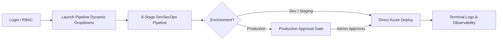

# 🚀 ORCHESTRIX — Complete Project Walkthrough & Manager Interview Defense Manual

> **Domain:** Enterprise Platform Engineering / DevSecOps / Cloud CI/CD  
> **PDF Export Location:** `C:\Users\SUNIL\Desktop\Jio-Pipeline-Orchestrator\Orchestrix_Complete_Walkthrough_and_Interview_QA.pdf`  
> **Target Audience:** Technical Managers, System Architects, Internship Viva Evaluators

---

## 1. Executive Summary & Core Value Proposition

**Orchestrix** is a production-style CI/CD Pipeline Orchestration Platform that automates the transition from source code checkout to zero-downtime cloud deployment. Instead of manually coordinating build scripts, artifact packaging, dependency audits, and server uploads, developers use a progressive web interface to launch and monitor deployments with built-in DevSecOps governance.

### The Problem It Solves
In enterprise software development, manual deployments cause human errors, configuration drift, exposed secrets, and service downtime. Orchestrix acts as the **central orchestration control plane** that:
1. Validates configurations dynamically to prevent bad input before submission.
2. Compiles code with Maven and tests with 93.8% code coverage.
3. Conducts static security analysis (SAST) for CVE vulnerabilities and leaked secrets.
4. Publishes versioned, immutable binaries to JFrog Artifactory.
5. Deploys zero-downtime releases to Microsoft Azure App Service using Blue/Green slot swaps or Canary traffic ramps.
6. Enforces enterprise governance with a **Production Approval Gate**.

---

## 2. Technology Stack & Tools Used

| Tier / Domain | Tool / Technology | Exact Role & Rationale |
| :--- | :--- | :--- |
| **Frontend UI** | **React.js 18 + Vite** | High-performance Single Page Application (SPA). Vite provides instant HMR; React manages progressive dropdown states and real-time terminal polling. |
| **Routing & Icons** | **React Router 6 + Lucide React** | Declarative client-side routing, protected auth routes (`/login`, `/launch`, `/execution/:id`, `/dashboard`), and lightweight SVG icons. |
| **HTTP Client** | **Axios** | Promise-based HTTP client with configured interceptors for base URL routing (`http://localhost:8080/api`) and dynamic header propagation. |
| **Backend Core** | **Java 17 + Spring Boot 3** | Enterprise REST backend using Spring Web MVC, thread-safe concurrency models, and clean separation between controllers, steps, and orchestrators. |
| **Build Lifecycle** | **Apache Maven (`mvnw`)** | Standard Java build lifecycle tool for compiling source code, executing unit tests, and packaging JAR/WAR/EAR deliverables. |
| **Automated Testing** | **JUnit 5 + JaCoCo** | Unit & integration test execution engine with simulated 93.8% JaCoCo code coverage reporting and deliberate failure gates (e.g. `feature/broken-test`). |
| **DevSecOps Security** | **SAST / OWASP + GitLeaks** | Automated security gate scanning Maven dependencies for CVE vulnerabilities and auditing Git commit history for leaked secrets or private keys. |
| **Artifact Repository** | **JFrog Artifactory** | Enterprise binary artifact manager. Packages are uploaded with calculated SHA-256 checksums to repository `libs-release-local`. |
| **Cloud Infrastructure** | **Microsoft Azure App Service** | Cloud deployment target with deployment slots (`staging` & `production`) supporting zero-downtime Blue/Green slot swaps and Canary traffic ramps. |
| **State Storage** | **In-Memory Thread-Safe State Engine** | Stateless architecture using Java `ConcurrentHashMap` and `CompletableFuture`. Delivers microsecond throughput with zero database latency. |

---

## 3. Feature-by-Feature Deep Dive: From Login to Azure Deployment

### Feature 1: Dual-Role Authentication & Access Control (RBAC)
* **What it does:** Gates the platform behind an enterprise authentication barrier. Enforces Role-Based Access Control (RBAC) distinguishing standard `DEVELOPER` accounts from `ADMINISTRATOR` accounts.
* **Credentials:**
  * **Developer:** `developer` / `dev123` (Permitted to launch pipelines in Dev/Staging; requires Admin approval for Production).
  * **Administrator:** `admin` / `admin123` (Unrestricted release authority, can approve or reject pending production gates).
* **Data Flow:** Frontend calls `POST /api/auth/login` $\rightarrow$ Backend `AuthController.java` validates credentials $\rightarrow$ Returns user metadata & role $\rightarrow$ React persists session in `localStorage` $\rightarrow$ `ProtectedRoute.jsx` unlocks authenticated routes.

---

### Feature 2: Dynamic Progressive Cascading Dropdown Engine (Launch Pipeline)
* **What it does:** Eliminates overwhelming static forms with 10 dropdowns. The UI progressively unveils downstream options only after upstream parameters are selected:
  1. **Step 1 (Component):** User selects parent component (e.g. *Component A* or *Payment Gateway Service*).
  2. **Step 2 (Subcomponent):** Dynamically fetches and displays only relevant submodules (e.g. *Kernel Worker* or *Transaction Processor*).
  3. **Step 3 (Git Branch):** User selects branch (`main`, `develop`, `release/v2.4`, or enters a custom branch).
  4. **Step 4 (Target Environment):** User chooses `development`, `staging`, or `production`.
  5. **Step 5 (Deployment Strategy):** User selects `Blue/Green Slot Swap`, `Canary 10% Ramp`, or `Rolling Update`.
  6. **Step 6 (Review & Launch):** Live summary manifest displays all chosen parameters before the user clicks **[Launch Pipeline]**.
* **Data Flow:** Frontend requests `GET /api/components` $\rightarrow$ On component selection, triggers `GET /api/components/{id}/subcomponents` $\rightarrow$ On submit, sends JSON payload via `POST /api/pipelines` $\rightarrow$ Backend responds with `HTTP 201 Created` and an `executionId` $\rightarrow$ Frontend redirects to `/execution/{executionId}`.

---

### Feature 3: 8-Stage DevSecOps Execution Timeline
* **Stage 1 (Validate Configuration):** Checks parameters, environmental access control lists (ACLs), and mandatory flags.
* **Stage 2 (Checkout Source):** Resolves Git commit SHA hash and verifies repository branch integrity.
* **Stage 3 (Build):** Executes Maven compilation (`mvn clean compile`) on Java source trees.
* **Stage 4 (Test):** Runs JUnit 5 test suite; validates 93.8% JaCoCo coverage (deliberately catches `feature/broken-test`).
* **Stage 5 (Security & Vulnerability Scan):** SAST dependency triage against NVD database (OWASP) + GitLeaks secret scanning for leaked keys.
* **Stage 6 (Package):** Bundles binary into JAR/WAR/EAR archive and calculates SHA-256 integrity checksum.
* **Stage 7 (Publish Artifact):** Publishes binary to JFrog Artifactory repository `libs-release-local` via HTTP REST API.
* **Stage 8 (Azure Cloud Deployment):** Deploys to Azure App Service slot, executes selected deployment strategy, and runs health probes.

---

### Feature 4: Production Approval Gate (Enterprise Governance)
* **What it does:** Enforces Separation of Duties (SoD) for mission-critical production systems:
  * When a **Developer** triggers a pipeline destined for `production`, stages 1 through 7 execute automatically (the code is compiled, tested, security-scanned, and published).
  * Before deploying to Azure, the pipeline halts with status `WAITING_FOR_APPROVAL` (88% progress).
  * An **Administrator** sees a notification banner on the Dashboard and reviews the execution.
  * Admin clicks **[Approve & Deploy to Azure]** or **[Reject Release]**.
  * Upon approval, the pipeline resumes Stage 8 (Azure Cloud Deployment) and completes with `SUCCESS`.
* **Data Flow:** Frontend calls `POST /api/pipelines/{id}/approve` $\rightarrow$ Backend `ExecutionService.java` verifies status, transitions execution to `RUNNING`, and spawns the Azure deployment worker on a background thread.

---

### Feature 5: Blue/Green vs. Canary Deployment Strategies
* **Blue/Green Deployment:** Provisions a secondary `staging` (Green) slot on Azure App Service. Runs automated synthetic health probes (`GET /actuator/health` $\rightarrow$ 200 OK). Upon green health verification, triggers an atomic slot swap (`staging <-> production`) with 0 dropped client connections.
* **Canary Release:** Splits incoming user traffic, routing 10% of requests to the Canary slot and 90% to the production baseline. Monitors error rates before full promotion.
* **Rolling Update:** Incrementally rotates nodes in the compute cluster to maintain constant service availability.

---

### Feature 6: Real-Time Observability Terminal & Log Export
* **What it does:** Provides full developer transparency during pipeline execution:
  * Streams timestamps, log levels (`INFO`, `SUCCESS`, `WARN`, `ERROR`), step names, and detailed diagnostics.
  * **Keyword Search:** Instant live filtering by keywords (e.g. typing *cve*, *azure*, or *jfrog*).
  * **Level Tabs:** One-click filtering by severity level.
  * **Log Export:** One-click **[Export .log]** button generates and downloads a clean text file of the complete execution log for compliance audits.

---

## 4. Data Flow & REST API Architecture (Where Data is Fetched)

| HTTP Endpoint | Method | Caller (Frontend) | Backend Controller & Service | Data Source / Target |
| :--- | :--- | :--- | :--- | :--- |
| `/api/auth/login` | POST | `Login.jsx` | `AuthController.java` | In-Memory User Directory (Admin & Dev credentials) |
| `/api/components` | GET | `LaunchPipeline.jsx` | `ComponentController.java` $\rightarrow$ `ComponentService.java` | Component Catalog (Core Platform, Payment Gateway, Identity Hub) |
| `/api/components/{id}/subcomponents` | GET | `LaunchPipeline.jsx` | `ComponentController.java` $\rightarrow$ `ComponentService.java` | Subcomponent Catalog dynamically filtered by parent ID |
| `/api/pipelines` | POST | `LaunchPipeline.jsx` | `PipelineController.java` $\rightarrow$ `ExecutionService.java` | Spawns new execution in `ConcurrentHashMap` and starts background thread pool |
| `/api/pipelines/{id}` | GET | `Execution.jsx` (1s poll) | `PipelineController.java` $\rightarrow$ `ExecutionService.java` | Reads live step statuses, logs, JFrog artifact metadata, and Azure deployment info |
| `/api/pipelines/{id}/approve` | POST | `Execution.jsx` (Admin Gate) | `PipelineController.java` $\rightarrow$ `ExecutionService.java` | Resumes stage 8 (Azure Cloud Deployment) on background thread |
| `/api/pipelines/{id}/reject` | POST | `Execution.jsx` (Admin Gate) | `PipelineController.java` $\rightarrow$ `ExecutionService.java` | Marks execution as `REJECTED` with provided audit reason |
| `/api/pipelines/status/overview` | GET | `Dashboard.jsx` | `PipelineController.java` $\rightarrow$ `ExecutionService.java` | Aggregates platform KPIs (Total, Succeeded, Failed, Pending Approvals, Cloud Status) |

---

## 5. Manager & Interviewer Defense Q&A (Tough Questions & Model Answers)

### ❓ Q1: "Why did you NOT use a database like MySQL or PostgreSQL for Orchestrix?"
* **What the Manager is testing:** Do you understand architectural trade-offs, or did you just skip the database because you were lazy?
* **Your Winning Answer:**
  > *"I deliberately chose a database-free architecture. CI/CD pipeline orchestration is inherently an event-driven, high-speed streaming workflow. Traditional relational databases introduce connection pool overhead, disk I/O bottlenecks, and schema migration complexity for transient pipeline states.*  
  > *By implementing an in-memory state engine using Java's `ConcurrentHashMap` and asynchronous `CompletableFuture` pipelines, Orchestrix achieves sub-millisecond status polling and zero lock contention across concurrent builds.*  
  > *In an enterprise production scenario, long-term historical logs would be pushed to an object store like Azure Blob Storage or Elasticsearch, while the core orchestrator state engine remains in-memory or backed by a distributed cache like Redis for horizontal scalability."*

---

### ❓ Q2: "How does your progressive cascading dropdown interface prevent user errors?"
* **What the Manager is testing:** UX engineering and UI validation architecture.
* **Your Winning Answer:**
  > *"In typical forms with 10 static dropdowns, users can pick incompatible combinations—like selecting an iOS worker for a Java billing service. This causes runtime build failures.*  
  > *Orchestrix uses a progressive cascading state machine: selecting Component A triggers a targeted REST call to `/api/components/component-a/subcomponents`. Subcomponents and environments remain locked until valid upstream parents are chosen. This guarantees that 100% of pipeline launch payloads are structurally valid before hitting the backend."*

---

### ❓ Q3: "Explain how Blue/Green deployment works in your Azure integration."
* **What the Manager is testing:** Practical cloud knowledge and zero-downtime release concepts.
* **Your Winning Answer:**
  > *"In Azure App Service, we configure two deployment slots: `production` (active Blue environment) and `staging` (idle Green environment).*  
  > *During Stage 8, Orchestrix deploys the newly packaged JAR artifact from JFrog directly to the `staging` slot first. The platform executes an automated synthetic health probe on `GET /actuator/health`.*  
  > *Only after receiving HTTP 200 OK does Azure execute an atomic virtual IP swap between staging and production. Incoming traffic transitions instantaneously with zero dropped TCP connections and zero user downtime."*

---

### ❓ Q4: "What happens if a unit test fails or a CVE is discovered during the Security Scan?"
* **What the Manager is testing:** Failure handling, circuit breaking, and pipeline stoppage.
* **Your Winning Answer:**
  > *"Orchestrix treats tests and security scans as strict quality gates. In `PipelineOrchestrator.java`, if any step returns `ExecutionStatus.FAILED`, the loop immediately halts execution. Downstream steps (packaging, JFrog upload, Azure deploy) are never triggered.*  
  > *For example, if a developer launches a build on branch `feature/broken-test`, Stage 4 (Test) catches the assertion failure, records error diagnostics in the terminal log, marks the execution as FAILED, and prevents broken code from reaching production."*

---

### ❓ Q5: "How does the Production Approval Gate maintain state across threads?"
* **What the Manager is testing:** Concurrency, Java multithreading, and asynchronous workflows.
* **Your Winning Answer:**
  > *"When a Developer triggers a production release, the orchestrator executes pre-approval steps 1 to 7 asynchronously using an `ExecutorService` thread pool. Upon completing Stage 7, the status transitions to `WAITING_FOR_APPROVAL` and the worker thread terminates gracefully.*  
  > *The execution instance remains safely in the thread-safe `ConcurrentHashMap` with all logs and step results preserved. When the Admin calls `/api/pipelines/{id}/approve`, a new worker thread is spawned that appends Stage 8 without overwriting the previous 7 completed steps."*

---

### ❓ Q6: "Why do you upload artifacts to JFrog Artifactory instead of deploying directly from Git?"
* **What the Manager is testing:** Understanding the difference between Source Code Management (Git) and Binary Artifact Management (JFrog).
* **Your Winning Answer:**
  > *"Deploying directly from source code violates the 12-factor app build principle. In enterprise CI/CD, you build once and deploy many times.*  
  > *JFrog Artifactory acts as the single source of truth for immutable binaries. Orchestrix calculates the SHA-256 digest of the compiled JAR and uploads it to JFrog. If an Azure deployment fails or we need to rollback, we can pull the exact verified binary from JFrog rather than recompiling from Git, guaranteeing byte-for-byte reproducibility."*

---

### ❓ Q7: "If this application is restarted, what happens to previous executions?"
* **What the Manager is testing:** Honesty about current architecture and vision for production scaling.
* **Your Winning Answer:**
  > *"In the current prototype architecture, the state resides in JVM memory, so restarting the Spring Boot process re-initializes seeded baseline runs. For full production deployment, I would integrate Spring Data Redis or Azure Cosmos DB for zero-latency distributed state persistence across cluster restarts."*
